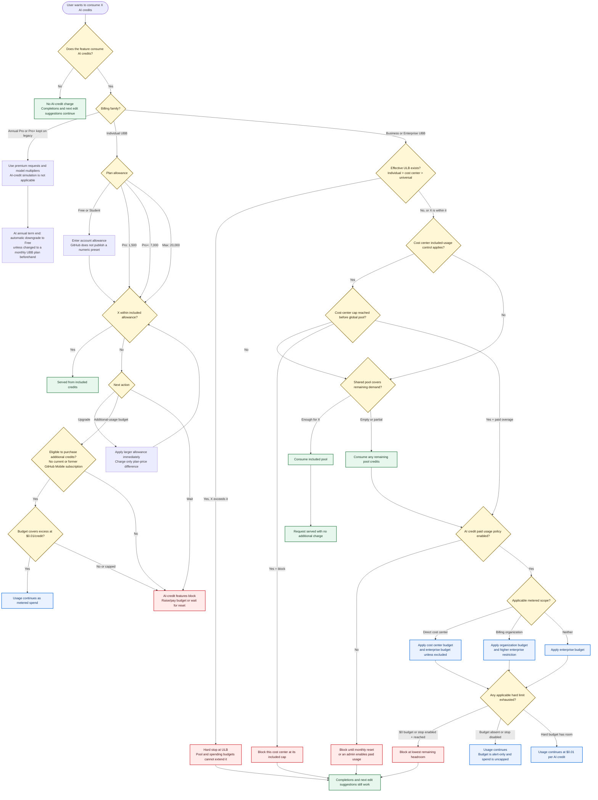

# GitHub Copilot AI credit decision flow

Research snapshot: 2026-08-25



## Precedence summary

```text
AI-credit feature
  -> billing model
  -> effective ULB (individual > cost center > universal)
  -> earliest included limit (cost-center cap or shared pool)
  -> paid-usage policy
  -> scoped metered budget + enterprise restriction
  -> served, metered, or blocked
```

A cost center with enterprise-budget exclusion skips the enterprise restriction.
For all other overlapping hard limits, the lowest remaining headroom wins.
