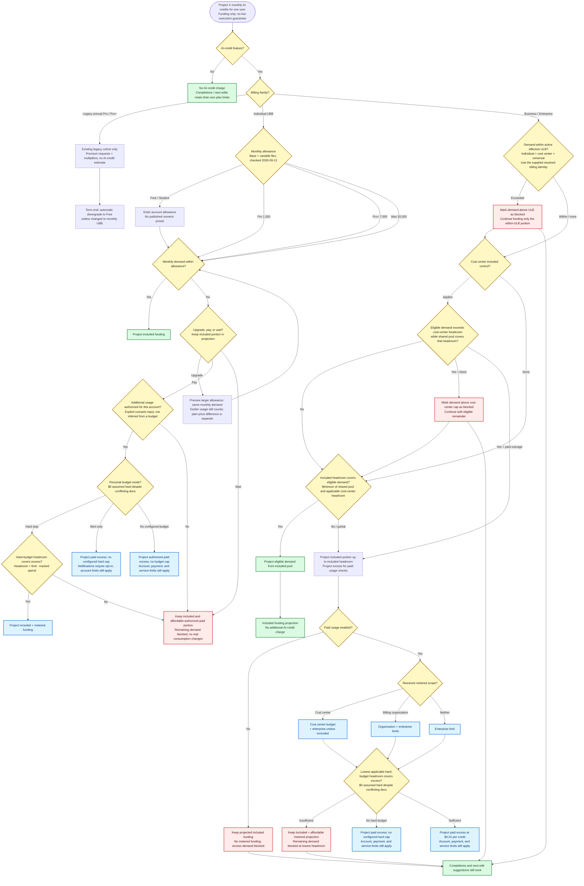

# GitHub Copilot AI-credit monthly funding flow

Research snapshot: 2026-09-12

This is the Credit Planner's monthly funding projection, not an atomic request
authorization flow. `X` is the target user's desired monthly consumption. The
planner projects how much can be funded before a control limits further usage;
partially funded demand is retained. Re-running a projection never changes the
scenario or advances balances.

Access, model availability, pricing, account authorization, and runtime policy
are not discovered or verified here. A funded amount is not a task-execution
guarantee. The application renders the Mermaid block below directly.

## Projection contract

- Managed demand is first limited by the active effective ULB. Other budgets
  cannot extend it. The remaining portion is evaluated for included and paid
  funding; a tighter funding constraint can stop that portion sooner.
- Included funding uses the lower shared-pool and applicable cost-center
  headroom. A blocking cost-center cap limits demand when reached before or
  alongside pool exhaustion. A paid-overage cap routes excess to paid checks.
- Metered funding is limited by paid authorization and the lowest applicable
  hard spending-budget headroom. Alert-only budgets add no cap and do not
  override another hard limit. Enterprise exclusions affect only that budget.
- For 100 desired credits, 60 included credits available, and paid usage off,
  the result is 60 funded and 40 blocked. With paid usage on and USD 0.20 of
  hard-budget headroom, it is 60 included, 20 metered, and 20 blocked.
- These are aggregate monthly estimates, not guaranteed per-response cutoffs,
  reservations, refunds, or rollback of real work. Every preview is immutable.

### Input accounting

Demand includes the target user's whole monthly usage. Pool and cost-center
consumption by others exclude this user's demand. Budget spend inputs are
amounts already tracked by that budget in the current cycle, excluding demand
being projected. Do not enter the same consumption twice. A newly created
budget does not retroactively count earlier spend, so its limit is not a cap
on the whole month's invoice.

Only active, unexpired individual ULB overrides belong in the scenario. Once an
override expires, remove it so the cost-center ULB, universal ULB, or no ULB
applies. Dates and intra-month configuration changes are supplied snapshots,
not automatically replayed by the planner.

Use resolved cost-center attribution: direct user assignment, then enterprise
team, then the organization granting the license. Among multiple enterprise
teams, the earliest-created team applies. Multiple licensing organizations can
change the billed organization each cycle; use the account's billing report.
The planner accepts the resolved assignment rather than discovering identities.

## Documented rules and assumptions

- USD 0.01 equals one AI credit. Current managed allowances are 1,900 credits
  per Business seat and 3,900 per Enterprise seat.
- Personal allowances are 1,500 for Pro (1,000 base + 500 flex), 7,000 for Pro+
  (3,900 + 3,100), and 20,000 for Max (10,000 + 10,000). Flex is variable; Free
  and Student require an account-provided amount. Checked 2026-09-12.
- Personal upgrades make the larger allowance available immediately, but prior
  monthly usage still counts. Plan-price differences are not included in this
  AI-credit-only estimate.
- Additional usage requires explicit account authorization. A missing budget
  alone never proves authorization. Once authorization is supplied, an absent
  budget adds no modeled spending cap. Account, payment, and service limits
  remain outside the forecast; this is not a promise of unlimited usage.
- Positive spending budgets stop only with Stop usage enabled. Budget alerts
  require opt-in; the planner identifies alert-only controls but does not send
  notifications or guarantee delivery. ULB alerts are not consistently available.
- **Unresolved USD 0 case:** GitHub's budget reference says any zero budget
  stops usage, while its table and setup guide describe toggle-dependent
  stopping. The planner conservatively treats zero as a hard stop even when
  the toggle is off and warns whenever this affects a paid projection. This
  is an explicit assumption, not a verified exception. ULBs are always hard.
- Enterprise overlap follows the explicit exclusion and higher-level
  restriction rules. Some tutorial summaries describe the enterprise budget
  as a fallback only; they should not be used to infer an exclusion.
- Included credits reset at 00:00:00 UTC on the first calendar day of each
  month, independently of invoice dates, and do not roll over.

## Boundaries

- Individual and managed monthly projections are implemented here. Legacy
  annual billing returns a not-applicable AI-credit result. The separate .NET
  Cost Compass analysis is historical context, not this app's runtime contract.
- GitHub Actions is a separate meter and is not calculated by this planner.
- Code review uses a user-supplied credit estimate. Organization-paid reviews
  for unlicensed users or bots have special attribution outside this path.
- Funding checks do not validate feature access, models, payment readiness,
  runtime approvals, or live request execution. No real work is executed.

## Official sources

Checked 2026-09-12:

- [Usage-based billing for individuals](https://docs.github.com/en/copilot/concepts/billing-and-usage/individuals/billing) publishes the displayed totals as fixed base credits plus a variable flex allotment. Flex can change as AI economics evolve.
- [Managed billing](https://docs.github.com/en/copilot/concepts/billing-and-usage/organizations-and-enterprises/billing) documents pools, resets, and account-level additional-usage limits.
- [Budgets](https://docs.github.com/en/copilot/concepts/billing-and-usage/organizations-and-enterprises/budgets) documents precedence, included caps, ULB expiration, and enterprise exclusions.
- [Setting up budgets](https://docs.github.com/en/billing/how-tos/set-up-budgets) documents personal Stop usage settings and opt-in alerts.
- [Budgets and alerts](https://docs.github.com/en/billing/concepts/budgets-and-alerts) documents creation-date accounting and alert limitations.
- [Cost-center allocation](https://docs.github.com/en/billing/reference/cost-center-allocation) documents assignment precedence and multiple-team tie-breaking.
- [Code review](https://docs.github.com/en/copilot/concepts/agents/code-review) documents special attribution and separate Actions charges.
- [What changed with Copilot billing (legacy)](https://docs.github.com/en/copilot/reference/copilot-billing/request-based-billing-legacy/what-changed-with-billing) applies only to existing annual Pro and Pro+ subscribers who remained on legacy request-based billing after 2026-06-01; it confirms the automatic downgrade at that annual term's end.
- The current individual billing, [plans](https://docs.github.com/en/copilot/get-started/plans), and [plan-management](https://docs.github.com/en/copilot/how-tos/manage-your-account/view-and-change-your-copilot-plan) pages checked do not establish a current/former GitHub Mobile exclusion for additional usage. The diagram therefore uses account-specific additional-usage authorization rather than asserting that rule.
